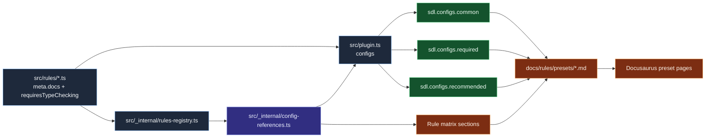

# Preset composition and rule matrix

This diagram explains how SDL rule metadata and preset definitions combine into user-facing preset guidance and rule enablement matrices.

## Practical use

- Use this chart when adding or reclassifying a rule across presets.
- Verify rule intent aligns with target preset (framework/runtime/type layering).
- Keep preset docs and rule matrix sections synchronized with metadata outputs.

## Common failure modes

1. Rule added to config object but omitted from docs matrix.
2. Rule listed in matrix but missing from actual preset object.
3. Rule doc matrix not updated after preset composition changes.
